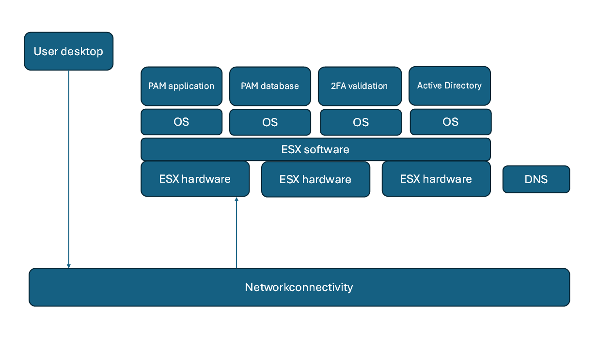

# Break Glass and PAM
Privileged Access Management (PAM) is used in many organizations to establish and control access to servers and applications as a user with elevated privileges, i.e. an administrator. Ideally the login process to the server or application is performed automatically without re-vealing it to the user. Other security measures like session recording and automatic creden-tials rotation are typically built-in capabilities.

A natural question to ask is “How to gain access to servers and application when PAM is not available?”
This is called Break glass or Emergency access to systems, and it is crucial for any critical system in an organization. Privileged Access Management solutions are critical for privileged access to onboarded systems, and it is therefore extremely important to consider emergency access in different disaster scenarios.

Looking at Break Glass at a wider perspective, there are other scenarios than PAM being una-vailable, which can also be considered as break glass scenarios.

Break Glass can be divided in at least three categories related to Privileged Access Manage-ment (PAM):
1.	PAM admin break glass for PAM application and necessary supporting infrastructure.
2.	Privileged user break glass for temporary access to their target systems when the normal access path via the PAM solution is unavailable.
3.	Privileged user break glass for emergency access to targets where the PAM solution is operational and will be used for providing break glass access to end-points.

When referring to Break glass credentials these can be username & password or SSH key-pairs. Use of either will depend on the technology used when accessing servers and applica-tions. Unless discussed explicitly they are used interchangeably.
Recommendations for successfully implementing PAM-related break glass processes are:  
1.	When designing and implementing a PAM solution, make sure to address the topic of break glass with key stakeholders, covering all three categories of break glass.
2.	Consider each category and type of break glass in this guidance and aim to design and implement break glass processes for all categories. It is ok to exclude chosen scenari-os if the given circumstances merit it. For example, if the PAM solution is strategically chosen to not provide break glass access for privileged users (category 3) – but omit-ting break glass scenarios must be an active and documented decision. 
3.	No solution should be considered fully implemented until processes are thoroughly documented, verified, and validated end-to-end. 
4.	Ensure necessary training and availability of break glass playbooks for relevant staff: Make sure you are not only relying on one individual to perform break glass. Ensure that all relevant team members of the respective teams are trained and confident on what to do in an emergency.
5.	To avoid confusion and misunderstandings always clarify what category of break glass you are addressing. Be aware of biases that may cause a given stakeholder having a tunnel vision on one category of break glass:
	a) PAM architects and engineers tend to focus on PAM Admin break glass to re-cover the PAM solution (category 1).
	b) Operationally-oriented stakeholders tend to focus on ensuring business conti-nuity and will prioritize that efficient break glass processes are in place in case of PAM outages to allow privileged user to retain access to target systems (category 2).
	3) Security- and compliance-oriented stakeholders tend to focus on getting any existing break glass processes covered by the PAM solution (category 3).
6.	Define a process for rotating or changing credentials, and for validating break glass credentials. Update break glass account passwords regularly.
7.	All break glass processes should end with closing the break glass access, i.e. revoke access rights and/or rotate exposed credentials. It is also recommended to review or audit all break glass incident: Are there any identified improvements for the process-es? Was a break glass access justified? Were break glass access rights abused?
8.	Keep break glass processes as simple as possible – users need to be able to perform break glass unassisted and autonomously. Can it be a self-service break glass access?
9.	Make sure break glass processes and credentials are secure and protected from abuse.
10.	Raise alerts when break glass processes are invoked (but avoid to outright block them). 
11.	Monitor and raise alerts when break glass credentials are used without a break glass process was started. Follow-up with break glass owner that the usage was justified.

Regardless of the break glass category applicable for the organization, there are some general topics to consider.

## Store break glass credentials

How are break glass credentials stored and accessed?

Are passwords are printed on paper, which is saved in a physical vault?

When a password needs to be typed for login, it can be entered manually, but it is infeasible to print SSH key pairs on paper and retype the private key when needed. 

Instead, it should be considered storing them electronically on an external disk or USB drive. Keep in mind that accessing the external drive or USB drive is also part of break glass process, and use of the drive must be tested to be functional. If credentials (passwords and SSH keys) are stored electronically, are they stored encrypted? 

Consider using a local password vault (e.g. KeePass, 1Password) and store the credentials there. The program for reading the vault is critical when retrieving break glass credentials. Consider storing a laptop in a physical safe with password vault software pre-installed and operational. Access and login to the laptop is also part of the break glass process. Also con-sider how the dedicated laptop OS and password vault application are kept up to date? 

Keep in mind that access or login credentials to local password vault application must be changed as per organization policies.

If a dedicated laptop is used, access or login credentials to the laptop must be changed as per organization policies.

## Accessing break glass credentials
When a user is accessing break glass credentials, is it single credential they will gain access to, or will the user have access to multiple or all credentials?

Consider if the break glass process defines that credentials must be changed after a user has obtained access break glass credentials. If the user performing break glass potentially has access to all break glass credentials (e.g. all credentials stored in KeePass), then all break glass credentials should be changed at end of a break glass event. 

## Set and rotate break glass credentials
How to set and rotate break glass credentials? Ideally, change of credentials should be han-dled without a single user has knowledge of complete credentials.

Is the password change done by typing a new password in a GUI or command shell?
If this is how passwords are changed, consider having two or more users each providing their part of a password. Split key scenarios, e.g. 3 of 5 parts required, is an option if the end-points (and PAM system) supports this. Are credentials stored combined or are they stored as indi-vidual parts? 

Also consider how SSH key-pair credentials are being updated. Where are the key-pair gener-ated, how are they store securely, and how is the public key distributed to the end-point need-ing break glass access.

Regardless of using username/password or SSH keys, it is very important to test and validate that new break glass credentials are actually working on the end-point where the break glass credentials are defined.

Instead of typing passwords and generating SSH key-pairs manually, an approach is to let PAM manage the break glass accounts. I.e. let PAM generate and update passwords and SSH key-pairs for break glass accounts. Built-in functionality with PAM is testing and validating new credentials are working for login at end-points. 

This is somehow a catch-22. One purpose for break glass is having an access mechanism to end-points when PAM is not operational (category 1 + 2), but it is PAM itself that is managing the break glass credentials. Ideally the PAM system has a built-in mechanism with an off-line vault, or a built-in mechanism to export credentials to a local password vault (e.g. KeePass, 1Password). If this is not available, but an API or CLI to both PAM and a local password vault is available, consider creating a program or script for fetching credentials from PAM and push them into the local password vault. Keep in mind that such a program or script will have ac-cess to credentials from PAM, thus is it critical that access to configuration for and executing it must be restricted as part of the break glass process. 

The break glass process must define when break glass credentials are changed, how the change process is performed, test and validation of new credentials, and how they are stored. 

## Monitor break glass credentials usage
When using a PAM solution one of the purposes can be to record activities performed while a user has elevated permissions on a server or application. This is the session recording capa-bility of the PAM solution. 

However, when using a break glass account (category 1+2), access to a server or application is done without using PAM, thus there is no session recording capability available. Alas, it is im-portant that the servers and applications are sending login events or syslog messages to a SI-EM solution, and that the SIEM solution is actively monitoring use of break glass credentials. If login using break glass credentials is detected, the SIEM solution should raise an alert. 

# PAM admin recovery of PAM (category 1)
This scenario is a category 1 break glass scenario. 
The aim is to reactivate PAM service as part of the disaster recovery or break glass process. When the PAM application and credentials are stored within PAM, then PAM is used to both open sessions to other end-points and to retrieve passwords for these.

It is important to consider and evaluate **all** components required for the PAM application to be operational. This includes, but is not limited to, the PAM application itself, OS hosting PAM application, PAM database (if external), ESX server, ESX hardware, network connectivity (switch), supporting systems and applications (e.g. Firewalls, AD, 2FA, DNS).  

For the PAM application itself there should be a break glass credential available. Exactly how this is technically done will depend on the specific PAM solution.

# Break Glass for all targets (category 2)
This scenario is a category 2 break glass scenario. 
Users can obtain the break glass credentials for the server or application and use the creden-tials for a session from their desktop to the end-point.
For standalone, but also for domain joined, servers and applications it should be considered to create a dedicated break glass user. The break glass user is what is handled through the break glass process. Depending on the nature of an outage triggering the break glass process, it may not be possible to validate user credentials with an Active Directory, thus local break glass users should be considered.
Regardless of the break glass credential is a local user or a domain user, it is important to test and validate that firewall rules will allow connection from users’ desktop to the end-point. Such firewall rules may not exist permanently, but in a break glass scenario they must be cre-ated or enabled permitting connections from the users’ desktop to servers and applications.
It is strongly recommended to change break glass credentials after they have been given to a user. It is not the act of using the break glass credentials that is important, but that a user has had access to the credentials. Alas, if all break glass credentials are stored in a local vault and a user potentially had access to them all, then they should all be changed.
The process of changing break glass credentials can be a manual process with several audit points and separation of duties. It should be considered using PAM as a mechanism to change break glass credentials and export these to safe storage.
There may be some systems and applications where PAM cannot or should not be responsible for the break glass credentials, and it is necessary to handle these manually. 
Regardless of how break glass credentials are updated, it is critical to conduct a test and vali-dation of new credentials as part of the sign-off process of changing credentials.

## Domain joined credentials
Specifically for systems and applications which are using Active Directory (or LDAP) for au-thentication. Assume that PAM is maintaining passwords for privileged users, and that it is only PAM service, which is unavailable, and that the remaining infrastructure is operational.

In such a scenario, it should be considered allowing an Active Directory user administrator to change password for privileged users in AD for the users needing administrator access to a server or application. 

User’s accounts are managed by PAM, but PAM is not operational. Until PAM is operational again, the user can use the privileged account directly and he/she now temporarily knows the password. When PAM is operational again, it can be used to test passwords for all managed credentials, and when a mismatch is found, update the credentials known only by PAM. Alt-hough this is a break glass scenario, the process of changing credentials must align with the automation available with PAM.

# Using PAM as Break Glass mechanism (category 3)
This scenario is a category 3 break glass scenario. 

Assume that PAM is highly redundant and that a complete outage of PAM is considered negli-gible. Also assume that the administrators have their own personal administrative creden-tials, which they use on a day-to-day basis.

If for whatever reason, their personal privileged credential is not working as expected, PAM a mechanism to gain access to a server or application with a break glass credential. It is in es-sence PAM, which is providing break glass access to end-points.

Such a setup should require an extensive high availability and is typically combined with a break glass process for recovering PAM itself (category 1).

When performing normal day-to-day administrative business, connections to servers and ap-plications is established without using PAM. Audit logging and event monitoring should be in place as there is no session recording provided through PAM (for day-to-day administration). When performing a break glass session through PAM, then session recording should be ena-bled as the break glass user account probably is a generic non-personal user.

# Break Glass for some PAM solutions
This section describes a category 1 break glass scenario for specific PAM solutions, i.e. how to restore PAM operation. 
There are many different PAM solutions available commercially and the description of the selected PAM solutions here is not an endorsement or recommendation for any PAM solution.

## BeyondTrust Password Safe
BeyondTrust Password Safe (PWS) has built-in administrators named “btadmin” and “biad-min” (names can be configured differently). The user “btadmin” is the appliance administrator (OS and appliance application). The username “btadmin” is by default also used for login to the operating system. At the OS level it is possible to create additional local administrators. The user “biadmin” is application administrator. There is a companion user “buadmin” required for updating the appliance. This user not considered necessary for break glass but must also be available for PAM administrators.

All users “btadmin” (appliance level), “btadmin” (OS level) and “biadmin” (application level) are local users in Password Safe and are the default administrators. At the appliance level it is not possible to create new users and there is only one administrator user. At the OS level and application level new users can be created and there can be multiple administrators availa-ble. Anyway, these local users are potentially all break glass credentials. 

Break glass credentials for underlying and supporting components must also be available. This may include, but is not limited to, ESX (vSphere/vCenter), ESX hardware (iLO), network switch-es, and DNS.

When changing the password for the PAM administrative accounts, be sure to validate that Password Safe is fully functional and that all components using the administrative account (if any) are still operational, and if not, update the configurations using the new password.

## Symantec PAM
Symantec PAM is deployed as an appliance where access to the operating system itself is only possible for Symantec Support and only with cooperation with an administrator of Sy-mantec PAM.

In PAM there are two levels of access. One access is for the configuration only and one access is for everything. For configuration only access, connect to “https://<hostname>/config/” and login with the user “config” and the correct password. Default password for the user “config” is “config”. It is strongly recommended to change the password at first login. It is not possible to create new users for the “config” level access. At the “config” level it is possible to rename the user “super” to something else.

For full access login to “https://<hostname/” as user “super” using the correct password. De-fault password is “super” and must be changed at first login. It is possible to define local or domain users with full access permissions in PAM. 

If PAM is setup as a cluster of PAM appliances the “config” user is unique to the specific appli-ance and a password change is not synchronized across cluster members. The password for the user “super” is synchronized across cluster members.

Both accounts “config” and “super” are break glass accounts.

It is possible to setup two independent PAM environments (not clustered) and let the first PAM system manage the password for the user “super” on the second PAM system and let the sec-ond PAM system manage the user “super” on the first PAM system. The PAM systems are tar-get systems for each other. 

## CyberArk

